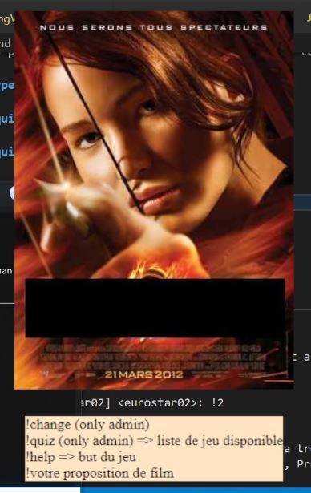
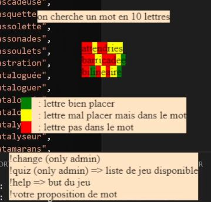
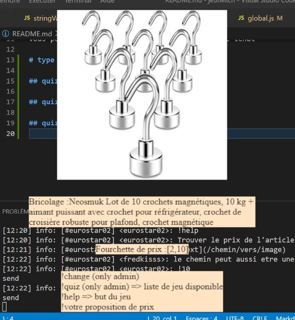

# jeutwitch

## install

Etape 1) FORK le projet  
Etape 2) npm i  
Etape 3) dans serveur remplir config.js  
Etape 4) npm run start  
Etape 5) Ouvrir localhost:3000/

Vous pouvez Jouer en live sur twitch avec votre tchat

# type de jeu

## quiz cinema

## quiz motus

## quiz justeprix

